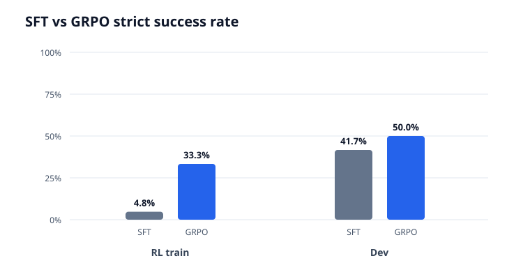

# AgenticArXiv-RL：SFT → GRPO 复现实验与可审计分析

这是一个面向简历展示的、可复现的 LLM Agent 实验分析项目。它不只展示最终百分比，
还把上游实验摘要的来源提交、文件哈希、评测协议、停止条件和结论边界固化为可执行流水线。



## 实验结论

在完全相同的 `seed=45`、`repeat=3`、离线工具快照和 Regex Agent 评测协议下：

| 数据集 | 样本数 | SFT 严格成功率 | GRPO 严格成功率 | 变化 |
|---|---:|---:|---:|---:|
| RL train diagnostic | 21 | 4.8% | 33.3% | **+28.57 pp** |
| Dev | 24 | 41.7% | 50.0% | **+8.33 pp** |

GRPO 训练在第 47/120 步因连续 5 个窗口组内奖励方差为零而提前停止，耗时 515.1 秒，
峰值显存 8.75 GiB。Dev 工具准确率保持 87.5%，参数准确率从 59.7% 提升到 62.5%；
RL train diagnostic 平均 token 从 3918.9 降至 3487.5。

结论需要克制：Dev 的两个新增成功样本都来自 `search_kw_agentic_rl`，因此这是“窄而真实的
正迁移证据”，不是广泛泛化能力已经提升的证明。完整分析见
[`results/report.md`](results/report.md)。

## 项目解决了什么问题

很多模型复现只保留截图，无法回答三个关键问题：

1. 指标究竟来自哪个代码提交和哪个原始文件？
2. SFT/GRPO 是否真的用了相同评测协议，可以直接比较？
3. 训练提前停止、奖励投机和负结果有没有被隐藏？

本项目的流水线会：

- 从 [Algorineko/AgenticArXiv-RL](https://github.com/Algorineko/AgenticArXiv-RL) 指定 checkout
  读取 9 组实验摘要；
- 记录 Git commit、manifest/summary SHA-256，只提交聚合指标，不复制原始 prompt 或模型输出；
- 用 manifest 与 summary 双向校验 SFT/GRPO 严格成功率；
- 只对样本数和协议一致的配对计算百分点变化；
- 自动生成机器可读 CSV、审计报告和 SVG 图表；
- 用单元测试覆盖指标范围、重复 ID、配对样本错位和结果文件生成。

```text
upstream summaries + v5 manifest
              │
              ▼
     provenance / hash checks
              │
              ▼
     controlled-pair validation
              │
              ├── results/metrics.csv
              ├── results/comparisons.csv
              ├── results/report.md
              └── results/strict_success.svg
```

## 一键复现分析

项目仅使用 Python 标准库，要求 Python 3.10+。

```powershell
# 1. 从本地上游 checkout 重新抽取并核验聚合数据
python src/agentic_arxiv_analysis/pipeline.py import `
  --source-repo ../../work/AgenticArXiv-RL `
  --output data/experiment.json

# 2. 重新生成表格、报告和图表
python src/agentic_arxiv_analysis/pipeline.py report `
  --data data/experiment.json `
  --output-dir results

# 3. 运行测试
python -m unittest discover -s tests -v
```

若上游摘要被修改但没有更新 manifest，导入会失败，而不是静默生成一份不可追溯的报告。

## 仓库结构

```text
├── data/experiment.json          # 带 commit 与 SHA-256 的聚合实验数据
├── results/
│   ├── comparisons.csv           # 受控 SFT/GRPO 配对及差值
│   ├── metrics.csv               # 9 组运行的统一指标表
│   ├── report.md                 # 自动生成的实验结论与限制
│   └── strict_success.svg        # 自动生成图表
├── src/agentic_arxiv_analysis/
│   └── pipeline.py               # 导入、校验、分析、报告流水线
└── tests/test_pipeline.py        # 单元测试 + 已提交结果回归测试
```

## 指标口径

`strict_success_rate` 采用上游 benchmark 的严格成功定义：完成任务、工具选择正确、参数与引用
完全正确、无解析/工具执行失败，并符合终止语义。历史 Base/SFT 指标保留在 `metrics.csv` 作为
背景观察；只有 v5 SFT/GRPO 同协议配对用于前后增益结论。

## 简历描述示例

> 构建 AgenticArXiv-RL 实验审计流水线，基于 Git commit 与 SHA-256 追踪 9 组 Base/SFT/GRPO
> 运行，自动校验同协议配对并生成 CSV/Markdown/SVG 报告；在 45 个配对评测样本上验证 GRPO
> 使严格成功率在 RL-train 诊断集提升 28.57 pp、Dev 提升 8.33 pp，同时识别增益集中于单一
> Dev 任务，避免过度泛化结论。

## 可复现性与限制

- 数据固定在上游提交 `50b1ef1c345f79d3ca8e3ce1ecbc953a4f1d71b0`，每个摘要均记录哈希。
- 这里复现的是**实验产物的导入、校验和统计分析**；完整重新训练仍需要上游模型、GPU 与快照。
- Dev 样本仅 24 条，结果适合作为工程验证，不构成统计意义上的通用能力证明。
- 本项目的分析代码使用 MIT License；上游代码、模型和实验素材仍遵循各自许可与条款。
